# Tile inspection platform

The software a reclaimed-tile warehouse uses to check its stock. Each tile rides a
conveyor through an inspection station and a camera photographs it. The U-Net you
trained in the notebook marks the usable area. The platform then decides whether the
tile can be sold, with no manual inspection needed. Borderline tiles go to a person,
and their decisions are kept as new training data.

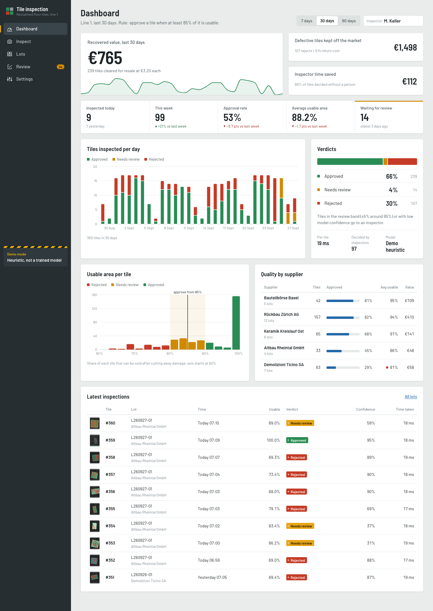

| Page | What it is for |
|---|---|
| **Dashboard** | Tiles inspected today and this week, approval rate, average usable area, review queue, recovered value (€), cost of defects kept off the market, throughput per day, verdict mix, usable-area histogram, quality by supplier, latest inspections |
| **Inspect** | Assign photos to a lot (supplier, date, tile type), drag and drop many photos or take one with the phone camera, and watch the batch move through the "camera gate". Each tile gets a photo/overlay slider (green = usable, red = cut away), its usable %, a verdict, a confidence and a processing time |
| **Lots** | Per-shipment summary (counts, approval rate, value), accept or reject the whole lot, CSV export, printable report |
| **Review** | Borderline and low-confidence tiles, least confident first. Approve (A) or reject (R) with a note. Every decision is signed and audited and lands in the retraining export |
| **Settings** | Threshold, review band and minimum confidence, with a live what-if on the last 30 days. Also prices and costs, the model file (path or upload) and a demo-data reset |

## Architecture

```
 phone / browser                        one Python process (uvicorn)
┌────────────────────────┐   /api/*   ┌──────────────────────────────────────────────────┐
│ React + TypeScript     │──────────▶ │ backend/app.py        FastAPI routes             │
│ (frontend/, Vite)      │            │   │                                              │
│ Recharts charts        │ ◀──────────│ backend/core.py       business logic (Platform)  │
│ built into frontend/   │  /media/*  │   ├── model_service.py  load .pt, run the U-Net  │
│ dist, served by the    │  photos,   │   │     └── heuristic.py  DEMO MODE fallback     │
│ same process           │  overlays  │   ├── rules.py          THE decision rule + €    │
└────────────────────────┘            │   ├── imaging.py        overlay + photo storage  │
                                      │   └── db.py             SQLite (var/platform.db) │
                                      │ backend/seed.py        30 days of demo history   │
                                      │ backend/sample_tiles.py  placeholder photos      │
                                      └──────────────────────────────────────────────────┘
```

* **One decision module.** `backend/rules.py` holds the rule and the money logic, and
  nothing else decides a verdict. With the defaults:

  | Usable share | Verdict |
  |---|---|
  | 90 % or more | APPROVE |
  | 80 % up to 90 % | REVIEW (a person decides) |
  | below 80 % | REJECT |

  A tile also goes to REVIEW when the model is unsure of its mask (confidence below 40 %)
  or when no tile is found in the photo. You can change all of these numbers in Settings.
* **usable_fraction** = usable pixels / (usable + damaged pixels), so it is measured on the
  tile, not on the whole image.
* **Confidence** = √(margin × mask certainty):
  * *margin* is 0 on the threshold, 0.5 at the edge of the band and 1 at twice the band;
  * *mask certainty* is the mean |2q − 1| over tile pixels, where q = P(usable | tile).
* Every inspection stores the rule and the model version it was decided with. Changing
  the rule never rewrites history, unless you tick "re-check undecided tiles in open lots".

## Run it on your laptop

You need **Python 3.10+** and, the first time, an internet connection. Node.js is **not**
needed: the built web interface is committed in `frontend/dist`.

| System | Start it |
|---|---|
| **Windows** | double-click **`start-windows.bat`**, or in PowerShell: `.\run.ps1` |
| **macOS** | double-click **`start-mac.command`** (first time: right-click → *Open*), or in Terminal: `./run.sh` |
| **Linux** | `./run.sh` |

The first run creates `.venv` and installs `requirements.txt`, which takes a few minutes and about 1 GB,
mostly PyTorch. On Linux without an NVIDIA GPU it installs the CPU build of PyTorch
(~200 MB instead of ~2.5 GB). It also fills an empty database with 30 days of demo history.
Then the browser opens at **http://127.0.0.1:8000**. If the port is taken, the next free one
is used and printed. Enter your name in the *Inspector* field; it goes into the audit trail.
The platform has no login. Stop it with Ctrl + C.

What the launchers take care of:

* **Which Python.** They use `$PYTHON`, then `python3` / `python`. On Windows they try the
  `py -3` launcher first and skip the Microsoft Store stub.
* **Unfinished installs.** `.venv/.installed` records the requirements that were installed.
  An interrupted or outdated install is repeated automatically. Delete `.venv` to start clean.
* **PowerShell policy.** `start-windows.bat` runs `run.ps1` with `-ExecutionPolicy Bypass` for
  that one process, and it keeps the window open if something fails.
* **Arguments.** Everything after the script name goes to `python -m backend`, e.g.
  `./run.sh --model ~/Downloads/platform_model.pt` or `.\run.ps1 --port 8080`.

Manual equivalent:

```bash
python -m venv .venv && source .venv/bin/activate      # Windows: .venv\Scripts\activate
pip install -r requirements.txt
python -m backend --open                               # --port 8000 --host 127.0.0.1
```

A phone on the same Wi-Fi can use the camera button. Start the server with
`--host 0.0.0.0` and open `http://<laptop-ip>:8000`.

**Frontend development** (needs Node.js 18+): run `python -m backend` in one terminal and
`cd frontend && npm install && npm run dev` in another. Then open http://localhost:5173 (Vite
proxies `/api` and `/media` to port 8000). Run `npm run build` before committing, so that
`frontend/dist` matches the source.

Other commands (run inside `platform/`):

| Command | Does |
|---|---|
| `python -m backend --model path/to/model.pt` | start with a specific model |
| `python -m backend seed --tiles 360 --days 30 --images DIR` | rebuild the demo history from photos in DIR |
| `python -m backend samples OUT --n 60` | write placeholder single-tile photos in the dataset layout |

Environment variables:

| Variable | Default | What it sets |
|---|---|---|
| `TILE_PLATFORM_DATA` | `platform/var` | where the database and photos go |
| `TILE_PLATFORM_CHECKPOINT` | none | the model file |
| `TILE_PLATFORM_IMAGES` | none | the photo folder used by the seed |
| `TILE_PLATFORM_DEVICE` | `auto` | the device: `auto`, `cpu`, `cuda` or `mps` |

**Demo photos.** The seed uses the first of these that exists:

1. the folder set in Settings or `--images`;
2. the course dataset, `../dataset_new/original`;
3. otherwise it generates 240 placeholder photos of one tile on a belt into
   `var/sample_tiles/`.

## Plug in your trained model

The platform needs a model that takes a grayscale tile photo `x` of shape (B, 1, 256, 256)
with values in [0, 1]. The photo is preprocessed the same way as in the notebook:
`convert("L")`, then resize to 256 bilinear, then /255. The model returns **logits of shape
(B, 3, 256, 256)**, with channel 0 = belt, 1 = usable and 2 = damaged zone. The platform
takes the argmax. A `(logits, bottleneck)` tuple from `forward_all` also works.
Legacy 1-channel models (sigmoid > 0.5 = usable) load too. The UI then warns that the
tile outline is estimated by a heuristic.

**Last cell of the notebook (Colab), Section 11:**

```python
from week3.project1.utils import export_for_platform

path = export_for_platform(best_model, "/content/drive/MyDrive/warehouse-inspector/platform_model.pt",
                           name="Our team's model", result=best_res)   # TorchScript + name/metrics .json
from google.colab import files
files.download(path)                                                     # -> platform_model.pt in your Downloads
```

**Why TorchScript?** It stores the compiled network, so the file loads on any computer with
PyTorch, whatever the Python version, and without the notebook's class code. A `save_model`
checkpoint (dill) stores that class code as Python bytecode, which only loads on the Python
version that saved it: a Colab checkpoint (Python 3.13) fails on a laptop with Python 3.11.

Then use any one of these:

* **Settings → Model → "Upload your model .pt"**. The file is stored in `models/uploads/`
  and loads at once.
* **Settings → Model file**: paste the path (e.g. `~/Downloads/platform_model.pt`), then
  click *Load model*.
* **`./run.sh --model ~/Downloads/platform_model.pt`**.

The shipped model is `models/default_model.pt`, loaded by default (*Use shipped model*). It is the
course staff's **ResNet-18 U-Net** (TorchScript, 57 MB), trained with the solution notebook on
`dataset_new`: 98.5 % test accuracy, mean IoU 0.958, usable-share error 0.9 points (details in
`models/default_model.json`). If the file is missing, the station runs in **DEMO MODE**, a
colour/texture heuristic that is clearly labelled in the sidebar and on every inspection.

How loading works:

* TorchScript files (from `export_for_platform` or `torch.jit.save`) are the recommended format.
* Files written by `save_model` are dill pickles: classes you defined in the notebook travel
  inside the file, but only load on the same Python version that saved them.
* `LatentUNetBase` is pickled by reference. `backend/compat.py` makes it importable: it
  uses the course repo when the platform runs from inside the repo, and registers a stand-in
  when the platform folder is copied on its own.
* A bare `state_dict` is refused with an explanation, because it holds weights without the
  model's class.
* An optional `<model>.json` next to the file can carry `name`, `version` and `metrics`.
* The model runs on CUDA when one is available, otherwise on the CPU (MPS on request).

## API

The interactive docs are at **/docs**. All routes are JSON unless marked otherwise.

| Method | Path | Purpose |
|---|---|---|
| GET | `/api/health` | liveness + model mode |
| GET | `/api/model` | loaded model: name, version, kind, classes, params, device, metrics, warning |
| POST | `/api/model/reload` | `{checkpoint}`; load a file, or fall back to demo mode |
| POST | `/api/model/upload` | multipart `file` (.pt/.pth/.ts); store it and load it |
| GET / PUT | `/api/settings` | rule, prices, model path, photo folder; PUT takes `{rules, model, image_source, actor, rescore_open_lots}` |
| POST | `/api/settings/preview?days=30` | what-if: verdict mix and money under the current vs. a proposed rule |
| POST | `/api/admin/reset-demo` | `{tiles, days, image_dir}`; wipe and reseed |
| GET | `/api/dashboard?days=30` | KPIs, throughput, histogram, suppliers, verdict mix, recent tiles |
| GET / POST | `/api/lots` | list (`?status=open&q=`) / create `{supplier, tile_type, received_date, reference}` |
| GET | `/api/lots/{id}` | lot summary |
| POST | `/api/lots/{id}/decision` | `{decision: accept or reject or reopen, actor, note}`; accept returns 409 while tiles wait for review |
| GET | `/api/lots/{id}/report` | report data (the printable page is `/lots/{id}/report`) |
| GET | `/api/lots/{id}/report.csv` | CSV export (text/csv) |
| POST | `/api/inspections` | multipart `lot_id`, `files[]`; inspect photos, returns one record each |
| GET | `/api/inspections?lot_id=&verdict=&limit=&offset=` | inspection list |
| GET | `/api/inspections/{id}` | one inspection + its audit trail |
| POST | `/api/inspections/{id}/review` | `{verdict: APPROVE or REJECT, inspector, note}`; human override |
| GET | `/api/review-queue` | tiles waiting for a person, least confident first |
| GET | `/api/audit?entity=` | audit trail (who / when / what) |
| GET | `/api/feedback`, `/api/feedback/export.csv` | inspector labels for retraining (CSV lists photo and 0/1/2 mask files) |
| GET | `/media/...` | stored photos, overlays and class masks |

## Tests

```bash
python -m pytest                                    # rules, API (TestClient), model loading: 44 tests
# UI, end to end in Chromium (needs frontend/dist and `pip install playwright && playwright install chromium`):
python -m pytest tests/test_ui.py
PLATFORM_PYTHON=.venv/bin/python /other/python -m pytest tests/test_ui.py   # Playwright in another env
SCREENSHOTS=docs python -m pytest tests/test_ui.py                          # also refresh screenshots
```

## Screenshots

| | |
|---|---|
| 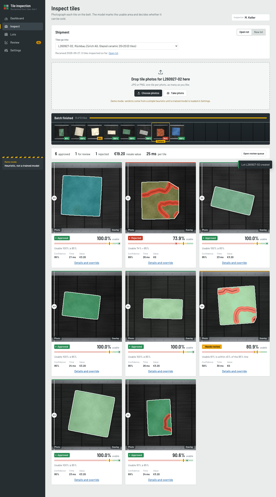 Inspect: batch results with overlay slider | 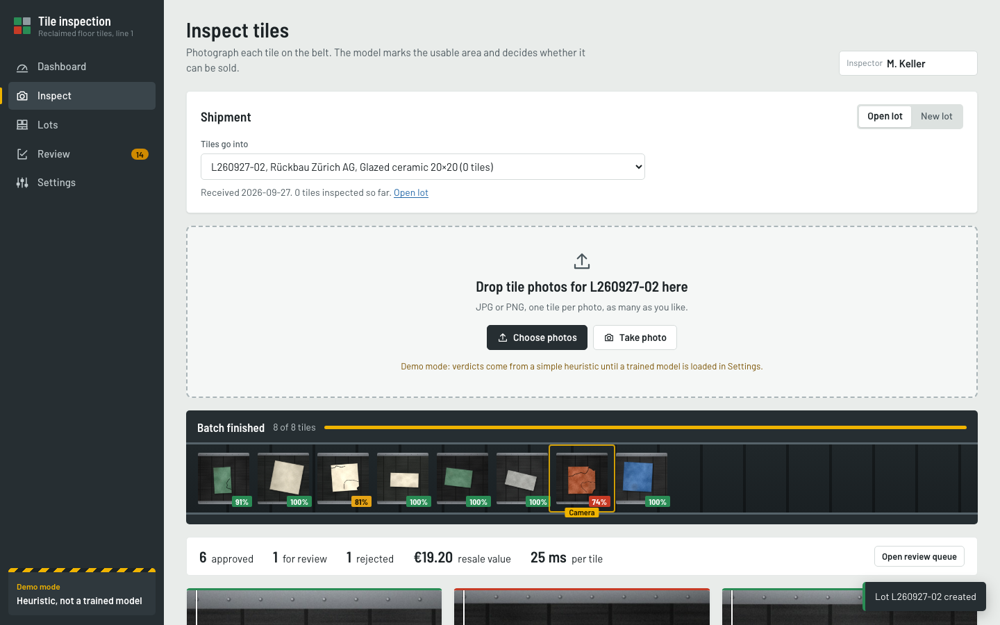 the conveyor while a batch runs |
| 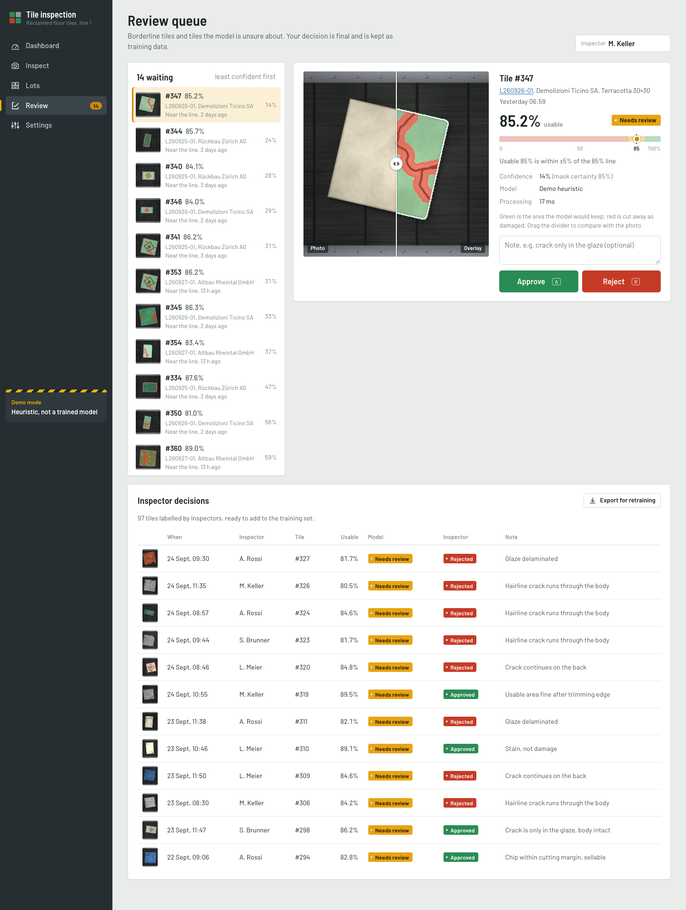 Review queue | 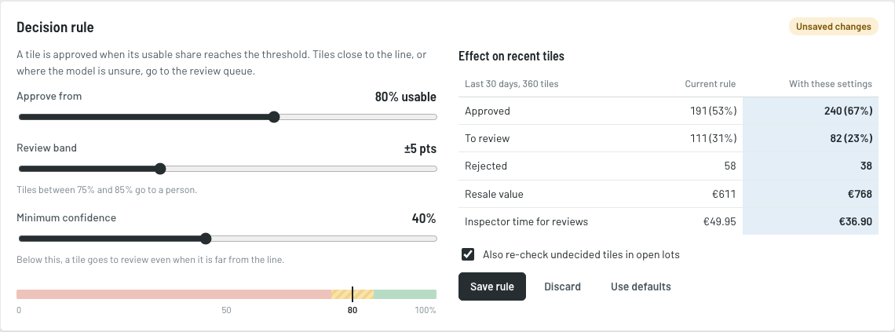 Settings: what-if on the rule |
| 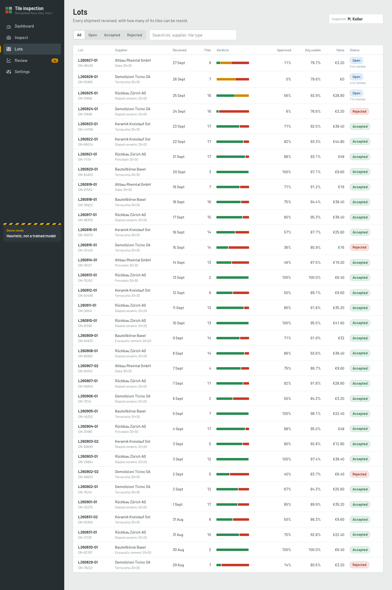 Lots | 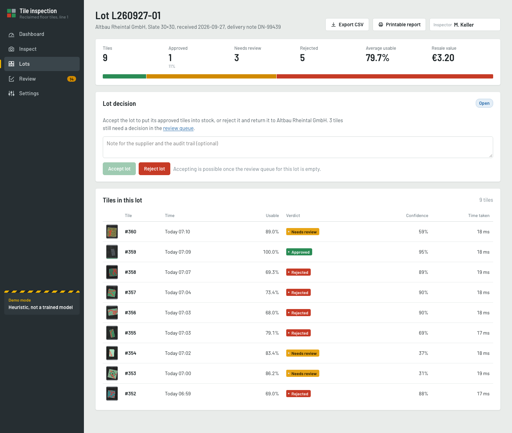 One lot and its decision |
| 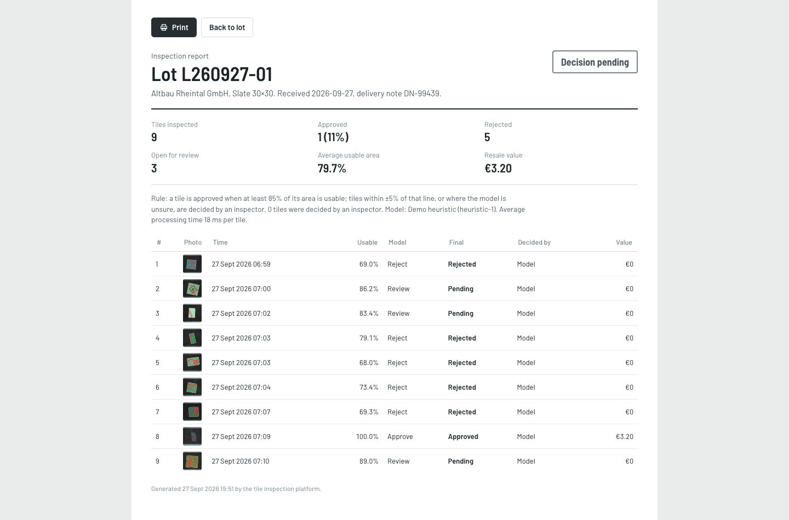 Printable lot report | 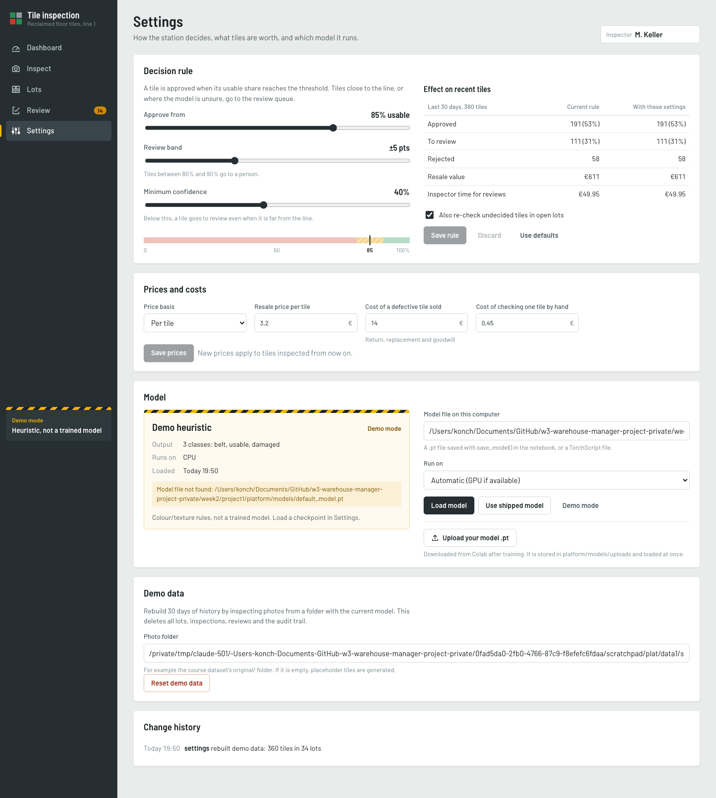 Settings |
| 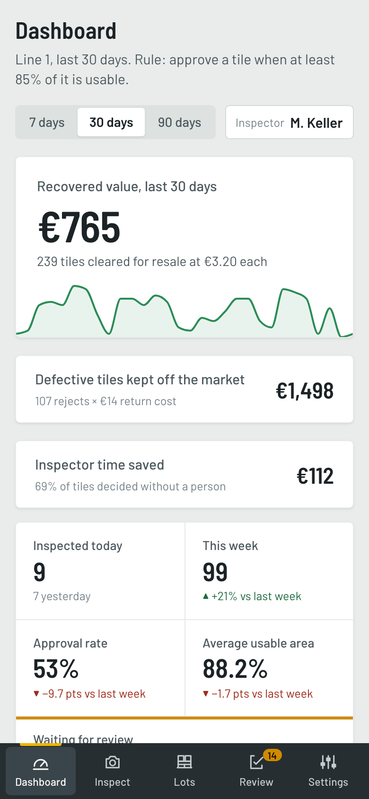 Phone | 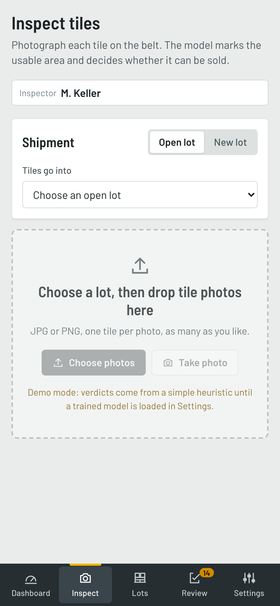 Phone: camera capture |

Fonts: Barlow and Barlow Semi Condensed (SIL Open Font License, bundled in
`frontend/src/fonts`). The frontend loads nothing from a CDN at runtime.
